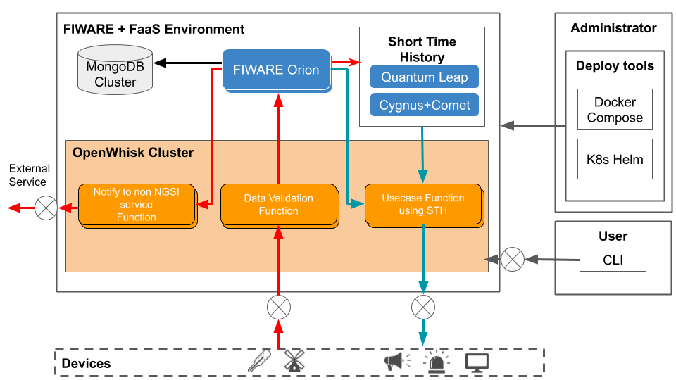

# Welcome to FIWARE Meteoroid

## Overview

Meteoroid realizes integrating Function as a Service(FaaS) capabilities in FIWARE.
Meteoroid provides the concept of integrating OpenWhisk and FIWARE.

## Architecture

Meteoroid is a concept that integrates FIWARE and FaaS.
The deploy tool provided by Meteoroid deploys the environment including the following components as the reference architecture.

- FIWARE Orion
  - The orion context broker is the core component of FIWARE. In Meteoroid, Orion triggers Open Whisk Action.
- OpenWhisk
  - Meteoroid uses OpenWhisk(FaaS) to execute several Functions.
- Deplooy tools
  - Administrator uses Helm Chart for Docker-compose and Kubernetes to deploy Meteoroid environment.
- CLI
  - User manages Meteoroid from CLI.
- Short Time History
  - Short Time History (STH) is not always a necessary component, but it is required when using time series data from Function.

## Implementation choices

To use Meteoroid, you can choose from two implementations.

- Without fiware-faas-integrator
  - You can choose not to use fiware-faas-integrator. In this case, you can use full features by directly using the Orion API or OpenWhisk API. See [Getting Started](https://github.com/OkinawaOpenLaboratory/fiware-meteoroid/blob/master/getting_started.md) for usage.

- With fiware-faas-integrator
  - [fiware-faas-integrator](https://github.com/OkinawaOpenLaboratory/fiware-faas-integrator) provides a management interface specialized for FaaS and FIWARE. Application developers can take advantage of the unified interface provided by fiware-faas-integrator for integrating Orion and Open Whisk. In addition, you can use the CLI interface dedicated to Meteoroid. It may have limited functionality compared to using Orion and OpenWhisk APIs directly without fiware-faas-integrator. Please see [here](https://fiware-meteoroid.readthedocs.io/en/latest/) for full documentation.

## Contribution guidelines

You should read this if you plan to contribute with code to Meteoroid

* [Contribution guidelines](./docs/contribution_guidelines.md)

## License

[GNU Affero General Public License](https://www.gnu.org/licenses/agpl-3.0.en.html)
