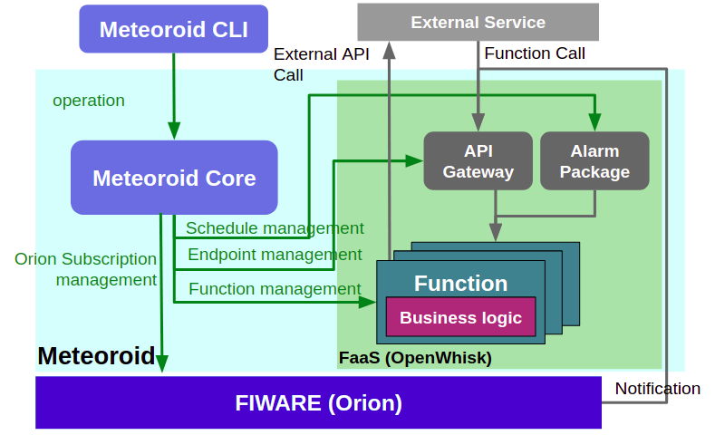

# Architecture

Meteoroid provides users with a function to centrally manage FIWARE Orion's Subscription function and [Apache OpenWhisk](https://openwhisk.apache.org/) FaaS function in order to realize an event-driven architecture in FIWARE.Meteoroid consists of OpenWhisk and Meteoroid core.

OpenWhisk provides the following items.

**FaaS environment**

- OpenWhisk Action
- OpenWhisk API
- OpenWhisk Alarm
- FIWARE's(Orion) Subscription

Meteoroid Core provide the following items.

**Abstraction resources**

- Meteoroid Function
- Meteoroid Endpoint
- Meteoroid Schedule
- Meteoroid Subscription

**Interfaces**

- [RESTful API](https://swagger.lab.fiware.org/?url=https://raw.githubusercontent.com/OkinawaOpenLaboratory/fiware-meteoroid/master/docs/swagger/swagger.yaml)

Meteorid is easily accessible from clients via a command line tool called the [Meteoroid CLI](./cli.md)

# API Resources Mapping

Abstraction resources are retreating with FaaS environment as follwing.

| Abstraction resources | FaaS environment |
| -- | -- |
| Meteoroid Function | OpenWhisk Action | 
| Meteoroid Endpoint | OpenWhisk API | 
| Meteoroid Schedule | OpenWhisk Action | 
| Meteoroid Subscription | FIWARE Orion Subscription | 

