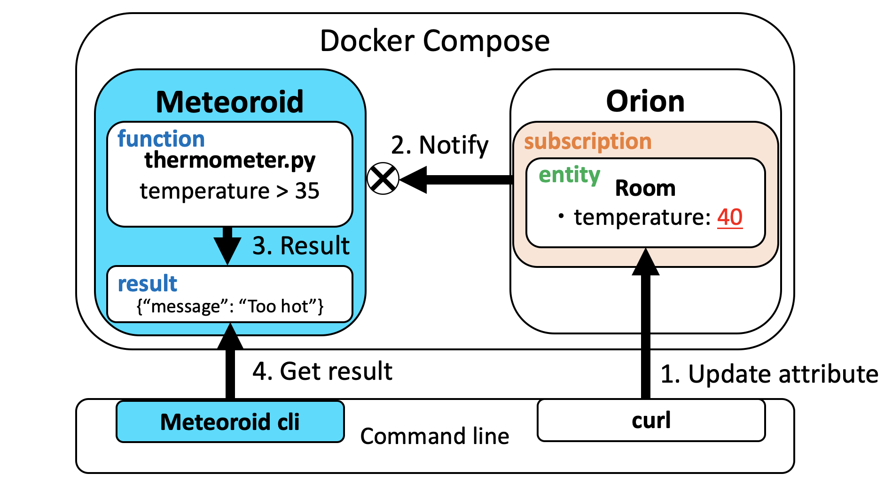

# Getting started
This getting started realizes a scenario such as the following image.

1. The user updates the temperature attribute of the Room entity using curl.
2. Orion notifies to the thermometer.py as a function in Meteoroid. (HTTP POST)
3. The function writes messages according to the value of temperature to result.
4. User can confirm results using Meteoroid CLI.




## Install

### Download Meteoroid
Download the fiware-meteoroid repository using git.

```bash
git clone https://github.com/OkinawaOpenLaboratory/fiware-meteoroid.git --recursive && cd fiware-meteoroid/
```

### Install [OpenWhisk](https://github.com/apache/openwhisk)
[OpenWhisk](https://github.com/apache/openwhisk) must be running to build Meteoroid.

```bash
cd fiware-meteoroid/docker/openwhisk-devtools/docker-compose
make quick-start
```

### Install Meteoroid core
To install the Meteoroid using Docker. (Docker Compose)

```bash
cd fiware-meteoroid/docker/
docker-compose up -d
```

### Install [Meteoroid CLI](https://github.com/OkinawaOpenLaboratory/fiware-meteoroid-cli)
To install the [Meteoroid CLI](https://github.com/OkinawaOpenLaboratory/fiware-meteoroid-cli) you can use pip.

[Meteoroid CLI Documentation](./cli.md)

```bash
pip install meteoroid-cli
```

### (Option) Export METEOROID_SCHEMA_ENDPOINT for CLI
**METEOROID_SCHEMA_ENDPOINT** is a specified URL to connect to Meteoroid core from Meteoroid CLI.
Please change the host and port as needed.

Default endpoint is **http://localhost:3000/schema/?format=corejson**

```
export METEOROID_SCHEMA_ENDPOINT=http://(host):(port)/schema/?format=corejson
```


## Usage

### Create a Python script
Create a Python script named **thermometer.py**.
The first argument of the main function is provided POST parameter and function param option.

#### Parameters

* **temperature**: The temperature is given an attribute of Entity as the HTTP request parameter(POST) assumed structures of Orion notification.
* **threshold**: The threshold is given parameters when creating or updating function as a command line option.

[Support Language](./programmers_manual/support_languages.md)

```python
def main(params):
    temperature = params['data'][0]['temperature']['value']
    threshold = int(params['threshold'])
    message = "No problem."
    if temperature > threshold:
        message = "Dangerous because it’s too hot!"
    print(temperature, message)
    return {"temperature": temperature, "message": message}
```
---

### Create Function
Create a function with the name **Thermometer**.
You can pass parameters to Function with the **param** option.

`meteoroid function create [name] [file path] --language [language:version] --param [key] [value]`

```bash
meteoroid function create Thermometer thermometer.py --language python:3 --param threshold 35
```

Output:

```
+---------------------+-------------------------------------------------------------+
| Field               | Value                                                       |
+---------------------+-------------------------------------------------------------+
| id                  | 1                                                           |
| code                | def main(params):                                           |
|                     |     temperature = params['data'][0]['temperature']['value'] |
|                     |     threshold = int(params['threshold'])                    |
|                     |     message = "No problem."                                 |
|                     |     if temperature > threshold:                             |
|                     |         message = "Dangerous because it’s too hot!"         |
|                     |     print(temperature, message)                             |
|                     |     return {"temperature": temperature, "message": message} |
|                     |                                                             |
| language            | python:3                                                    |
| binary              | False                                                       |
| main                |                                                             |
| version             | 0.0.1                                                       |
| parameters          | [{'key': 'threshold', 'value': '35'}]                       |
| fiware_service      |                                                             |
| fiware_service_path | /                                                           |
| name                | Thermometer                                                 |
+---------------------+-------------------------------------------------------------+
```

---

### Create Endpoint

Create an endpoint with the name hello.
For function ID, specify the ID of the Function created in the previous step.

`meteoroid endpoint create [basepath(name)] [path] [method] [function ID]`

```bash
meteoroid endpoint create room /thermometer post 1
```

Output:

```bash
{'id': 1, 'url': 'http://192.168.128.100:9090/api/23bc46b1-71f6-4ed5-8c54-816aa4f8c502/room/thermometer', 'fiware_service': '', 'fiware_service_path': '/', 'name': 'room', 'path': '/thermometer', 'method': 'post', 'function': 1}
```

---

### Invoke the function using curl
Invoke the function with the URL obtained when created endpoint.
Request parameter is specified as JSON assuming structures of Orion notification.

```bash
curl -X POST http://192.168.128.100:9090/api/23bc46b1-71f6-4ed5-8c54-816aa4f8c502/room/thermometer -H 'Content-Type: application/json' -d @- <<EOF
{
    "data": [{
        "temperature": {
            "value": 30
        }
    }]
}
EOF
```

Output:

```
{
  "message": "No problem.",
  "temperature": 30
}
```

---

### Create Entity

Subscription is notified to Meteoroid by creating an entity.
The function is called by Orion subscription.

```bash
curl http://localhost:1026/v2/entities -X POST -H 'Content-Type: application/json' -d @- <<EOF
{
    "id": "Room1",
    "type": "Room",
    "temperature": {
        "type": "Number",
        "value": 25
    }
}
EOF
```
---

### Create Subscription

Create a subscription.

`meteoroid subscription create [endpoint ID] [orion subscription json]`

```bash
meteoroid subscription create 1 '{
        "description": "Example subscription",
        "subject": {
            "entities": [
            {
                "id": "Room1",
                   "type": "Room"
            }
        ]
        },
        "notification": {
            "attrs": [
                "temperature"
            ]
        },
        "expires": "2040-01-01T14:00:00.00Z",
        "throttling": 1
    }'
```

Output:

```bash
{'id': 1, 'fiware_service': '', 'fiware_service_path': '/', 'endpoint_id': 1, 'orion_subscription_id': '5e61a087b2a79e45bd8de8d5'}
```

---

### Invoke the function using Orion subscription
Update the temperature attribute using curl.

```bash
curl http://localhost:1026/v2/entities/Room1/attrs -H 'Content-Type: application/json' -d @- <<EOF
{
    "temperature": {
        "value": 40
    }
}
EOF
```

---

### Confirm result list
Obtain results of function using Meteoroid CLI.
You cannot obtain the latest results unless You execute the following command twice.

`meteoroid result list`

```bash
meteoroid result list
```

Output:

```
+----------------------------------+-------------+-----------+----------+---------------+---------------+---------+-------------+---------+
| activation_id                    | name        | namespace | duration | start         | end           | publish | status_code | version |
+----------------------------------+-------------+-----------+----------+---------------+---------------+---------+-------------+---------+
| 3f77cf6e89bb4941b7cf6e89bba94122 | Thermometer | guest     |       28 | 1583462834589 | 1583462834617 | False   |           0 | 0.0.1   |
+----------------------------------+-------------+-----------+----------+---------------+---------------+---------+-------------+---------+
```

---

### Confirm message of function
Show a result using the activation ID.

`meteoroid result show [activation ID]`

```
meteoroid result show 3f77cf6e89bb4941b7cf6e89bba94122
```

Output:

```
+---------------+-----------------------------------------------------------------------------------------------------------------------------------------------------------------------+
| Field         | Value                                                                                                                                                                 |
+---------------+-----------------------------------------------------------------------------------------------------------------------------------------------------------------------+
| activation_id | 3f77cf6e89bb4941b7cf6e89bba94122                                                                                                                                      |
| name          | Thermometer                                                                                                                                                           |
| namespace     | guest                                                                                                                                                                 |
| duration      | 28                                                                                                                                                                    |
| start         | 1583462834589                                                                                                                                                         |
| end           | 1583462834617                                                                                                                                                         |
| publish       | False                                                                                                                                                                 |
| status_code   | 0                                                                                                                                                                     |
| version       | 0.0.1                                                                                                                                                                 |
| logs          | ['2020-03-06T02:47:14.6097906Z   stdout: 40 Dangerous because it’s too hot!']                                                                                         |
| response      | OrderedDict([('result', OrderedDict([('message', 'Dangerous because it’s too hot!'), ('temperature', 40)])), ('size', 68), ('status', 'success'), ('success', True)]) |
+---------------+-----------------------------------------------------------------------------------------------------------------------------------------------------------------------+
```
