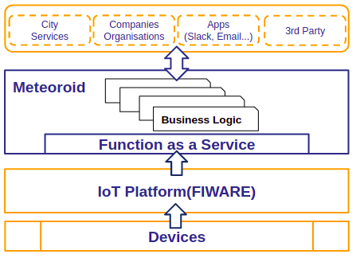
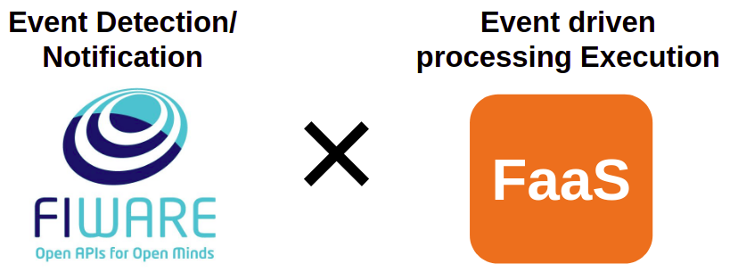

# Welcome to Meteoroid Documentation

Meteoroid is open source software that can execute business logic for each function, triggered by events notified from the IoT platform ([FIWARE](https://www.fiware.org/developers/)).

Since Function can implement and execute any business logic, it is easy to process data notified by the IoT platform and notify external services.

Because Meteoroid is composed of containers, you can easily and quickly build a Function as a Service (FaaS) environment that can implement and execute applications on a function-by-function basis, such as AWS Lambda and GCP Cloud Functions. In addition, using Meteoroid has the advantage that application developers are freed from cumbersome infrastructure preparation and can concentrate on business logic development only.

## Backgraund

As for the system architecture in the DX era, with the spread of IoT and the transformation of business models, "services of goods" and "digital twins" have advanced, and the use cases of event-driven architectures are increasing.

In order to utilize IoT data, the importance of open IoT platforms that can handle standard OpenAPI and data models is increasing, and FIWARE developed in Europe is attracting attention.

However, although FIWARE has a function of detecting a change in sensig data of an IoT device and issuing an event due to the change, there is a problem that a function of executing a process in response to an event is insufficient.
 
To solve this problem, Meteoroid was created to solve the above-mentioned problems by combining FWARE and FaaS functions, and to establish an event-driven mechanism.

